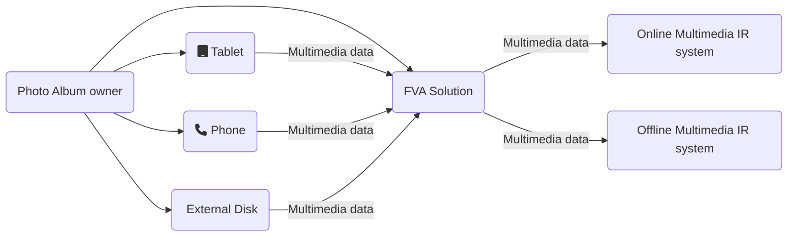

<p align="center">
  <a href="./resources/icons/main.png" target="blank"></a>
</p>
<p align="center">
  
  
  
  
  </br>
  
  
  
  </br>
  <a href="https://github.com/dimanikulin/capable-cpp-template/actions/workflows/multi-platform-build.yml"></a>
  
  
  </br>
  
  
  
  
  </br>
  <a href="https://github.com/dimanikulin/capable-cpp-template/projects/1"> </a>
  
    
  <a href="https://github.com/dimanikulin/capable-cpp-template/edit/master/README.md"> </a>
  </br>

</p>

# Quick Links

- [Description](https://github.com/dimanikulin/capable-cpp-template?tab=readme-ov-file#description)
- [Features](https://github.com/dimanikulin/capable-cpp-template?tab=readme-ov-file#features)
- [Initialization](https://github.com/dimanikulin/capable-cpp-template?tab=readme-ov-file#initialization)
- [Building](https://github.com/dimanikulin/capable-cpp-template?tab=readme-ov-file#building)
- [Using QT](https://github.com/dimanikulin/capable-cpp-template?tab=readme-ov-file#using-qt)
- [Testing](https://github.com/dimanikulin/capable-cpp-template?tab=readme-ov-file#testing)
- [Formatting](https://github.com/dimanikulin/capable-cpp-template?tab=readme-ov-file#formatting)
- [Static analyzers](https://github.com/dimanikulin/capable-cpp-template?tab=readme-ov-file#static-analyzers)
- [Code coverage](https://github.com/dimanikulin/capable-cpp-template?tab=readme-ov-file#code-coverage)
- [Documentation](https://github.com/dimanikulin/capable-cpp-template?tab=readme-ov-file#documentation)
- [Packaging](https://github.com/dimanikulin/capable-cpp-template?tab=readme-ov-file#packaging)
- [Coming Features](https://github.com/dimanikulin/capable-cpp-template?tab=readme-ov-file#coming-features)
- [Contributing](https://github.com/dimanikulin/capable-cpp-template?tab=readme-ov-file#contributing)
- [Author](https://github.com/dimanikulin/capable-cpp-template?tab=readme-ov-file#author)
- [License](https://github.com/dimanikulin/capable-cpp-template?tab=readme-ov-file#license)

# Description

A template for *C++* projects featuring CI, building, testing, formatting, documentation, and more.

Designed as a starting point with a wide range of features that can be easily included or excluded based on your needs.

This template reflects my personal approach, so you may have different preferences regarding its implementation.

Any feedback is greatly appreciated!

# Features

| # | Feature                     | CI support | Description    |
| - | ----------------------------|------------|:--------------:|
|  | **License**                  | N/A        |  Fully open license. The project is licensed under the [Unlicense](https://unlicense.org/)|
|  | **MD templates**             | N/A        | Attractive main *README* (*Logo*, *Badges*, *Quick Links*, *Tables*, *Diagrams*) |
|  | **Building**                 | Yes        | Build with *Ninja* and *CMake,* Use of *Ccache* to speed up the builds |
|  | **Testing**                  | Yes        | Unit testing with *GoogleTest* and *CTests* (with an option to enable testing) |
|  | **CI**                       | Yes        | Using *GitHub Actions* CI workflows for *Windows,* *Linux* and *MacOS* operation systems |
|  | **gitignore**                | N/A        | uses well know ignore file [from](https://github.com/github/gitignore) |

What is important - you can disable the things you don't use.

# Initialization

There are two ways to install the project:

- clone if from [GitHub](https://github.com/dimanikulin/capable-cpp-template)
- [use this repo as template](https://github.com/dimanikulin/capable-cpp-template/generate)

If you would like to clone the repository please run:

```bash
git clone https://github.com/dimanikulin/capable-cpp-template/
```

## Readme.md

You need to provide *an icon* at *./resources/icons/main.png* if you wish to include *an icon* in this *README* file.

Update the *href* in badges to point to your repository (note: the repository must be public to use badges)

*GitHub* supports *Mermaid.js* for creating diagrams, such as:



## Building

Then please update `"Project"` in `CMakeLists.txt`

```cmake
project(
  "Project"
  VERSION 0.1.0
  LANGUAGES CXX
)
```

with your project name.

# Building

To build the project you will need to run *CMake* routine like to the one below:

```bash
mkdir build/ && cd build/
cmake --build . 
```

You can build it locally and in a *CI* environment.

# Testing

The template uses [Google Test](https://github.com/google/googletest/) for unit testing.
Unit testing is enabled by default via the `BUILD_TESTS` option.
To run tests, use *CTest* from the build directory:

```bash
cd build          
ctest -C Release

```

Tests can be executed both locally and in a *CI* environment.

# Coming features

- Documentation with Doxygen and README support (CI and local)
- Publish documentation on GitHub Pages
- QT support (CI and local)
- Contribution guidelines, issue templates, and pull request templates
- Clang-Format configuration
- CMake formatting
- Static analysis tools
- Code coverage reports
- Package manager support
- Windows package creation using WiX
- Publish test results + GoogleMock integration
- Python formatting and linting
- Cross-compilation

# Formatting

TBD

# Static analyzers

TBD

# Code coverage

TBD

# Packaging

TBD

# Using QT

TBD

# Documentation

TBD

# Contributing

TBD

# Author

[Dmytro Nikulin](https://github.com/dimanikulin)

# License

This project is licensed under the [Unlicense](https://unlicense.org/) - see the [LICENSE](https://github.com/dimanikulin/capable-cpp-template?tab=Unlicense-1-ov-file) file for details
