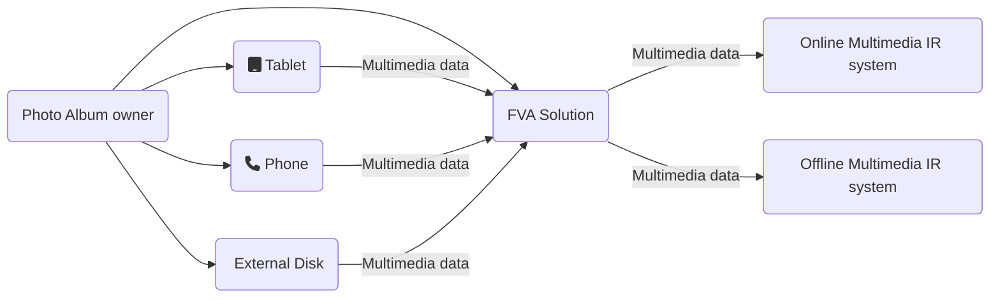

<p align="center">
  <a href="./resources/icons/main.png" target="blank"></a>
</p>
<p align="center">
  
  
  
  
  </br>

  
  
  
  </br>
  <a href="https://github.com/dimanikulin/capable-cpp-template/actions/workflows/main.yml"></a>
  
  
  </br>
  
  
  
  
  </br>
  <a href="https://github.com/dimanikulin/capable-cpp-template/projects/1"> </a>
  
  
  <a href="https://github.com/dimanikulin/capable-cpp-template/edit/master/README.md"> </a>
  </br>

</p>

# Quick Links

- [Description](https://github.com/dimanikulin/capable-cpp-template?tab=readme-ov-file#description)
- [Features](https://github.com/dimanikulin/capable-cpp-template?tab=readme-ov-file#features)
- [Initialization](https://github.com/dimanikulin/capable-cpp-template?tab=readme-ov-file#initialization)
- [Building](https://github.com/dimanikulin/capable-cpp-template?tab=readme-ov-file#building)
- [Using QT](https://github.com/dimanikulin/capable-cpp-template?tab=readme-ov-file#using-qt)
- [Testing](https://github.com/dimanikulin/capable-cpp-template?tab=readme-ov-file#testing)
- [Formatting](https://github.com/dimanikulin/capable-cpp-template?tab=readme-ov-file#formatting)
- [Static analyzers](https://github.com/dimanikulin/capable-cpp-template?tab=readme-ov-file#static-analyzers)
- [Code coverage](https://github.com/dimanikulin/capable-cpp-template?tab=readme-ov-file#code-coverage)
- [Documentation](https://github.com/dimanikulin/capable-cpp-template?tab=readme-ov-file#documentation)
- [Packaging](https://github.com/dimanikulin/capable-cpp-template?tab=readme-ov-file#packaging)
- [Coming Features](https://github.com/dimanikulin/capable-cpp-template?tab=readme-ov-file#coming-features)
- [Contributing](https://github.com/dimanikulin/capable-cpp-template?tab=readme-ov-file#contributing)
- [Author](https://github.com/dimanikulin/capable-cpp-template?tab=readme-ov-file#author)
- [License](https://github.com/dimanikulin/capable-cpp-template?tab=readme-ov-file#license)

# Description

A template for C++ projects using CI, Building, Testing, Formatting, Documenting and more.

Aimed to use starting point with a big number of features with easy way to include or exclude a feature.

This is my POV on such a type of template, thus you might disagree with what I use and how I do things.

And any feedback is really appreciated!

# Features

| # | Feature                 | CI support | Description    |
| - | ------------------------|------------|:--------------:|
|  | License                  | N/A        |  Fully open license. The project is licensed under the [Unlicense](https://unlicense.org/)|
|  | MD templates             | N/A        | Attractive main README (Logo, Badges, Quick Links, Tables, Diagrams), TBD |
|  | Building                 | Yes        | TBD, Use of Ccache to speed up the builds |

# Initialization

There are two options to install the project:

- clone if from [GitHub](https://github.com/dimanikulin/capable-cpp-template)
- [use this repo as template](https://github.com/dimanikulin/capable-cpp-template/generate)

If you would like to clone the repository please run:

```bash
git clone https://github.com/dimanikulin/capable-cpp-template/
```

## Readme.md

You need to provide an icon located at "./resources/icons/main.png" if you wish to use the icon in this README file.

Then you need to updated "href" in badges to refer to your repository. But please notice repo must be public to use badges.

Also in GitHub README.MD you can use *mermaid* to draw different diagrams like in the following example:



## Building

Then please update `"Project"` in `CMakeLists.txt`

```cmake
project(
  "Project"
  VERSION 0.1.0
  LANGUAGES CXX
)
```

with your project name.

# Building

Locally or on CI
TBD

# Using QT

TBD

# Testing

Locally or on CI
TBD

# Formatting

TBD

# Static analyzers

TBD

# Code coverage

TBD

# Documentation

Locally or on CI

TBD

# Packaging

TBD

# Coming features

- build with Ninja and Cmake(CI)
- CMake configuration
- Documenting using Doxygen and Readme support (CI and Local) with Doxy configuration, Publish of documentation on git hub pages
- Unit testing support, through GoogleTest and CTests (with an option to enable GoogleMock) (CI and Locally) and Publish Test Results
- Using GitHub Actions CI workflows for Windows Linux and MacOS

# Coming features, next

- Using QT (CI and Locally)
- Md Contributing Guideliness, Issues and Pull Requests,
- An example of a Clang-Format config, inspired from the base Google model, with minor tweaks. This is aimed only as a starting point, as coding style is a subjective matter, everyone is free to either delete it (for the LLVM default) or supply their own alternative,
- Static analyzers integration, with Clang-Tidy and Cppcheck(CI and Locally), the former being the default option,
- Code coverage, enabled by using the ENABLE_CODE_COVERAGE option, through Codecov CI integration,
- Package manager support, with Conan and Vcpkg, through their respective options, use Wix for win packages
- use boold and italic
- proofread

# Contributing

TBD

# Author

[Dmytro Nikulin](https://github.com/dimanikulin)

# License

This project is licensed under the [Unlicense](https://unlicense.org/) - see the [LICENSE](https://github.com/dimanikulin/capable-cpp-template?tab=Unlicense-1-ov-file) file for details
