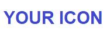

<p align="center">
  <a href="./resources/icons/main.png" target="blank"></a>
</p>
<p align="center">
  
  
  
  
  </br>
  
  
  
  </br>
  <a href="https://github.com/dimanikulin/capable-cpp-template/actions/workflows/multi-platform-build.yml"></a>
  
  
  </br>
  
  
  
  
  </br>
  <a href="https://github.com/dimanikulin/capable-cpp-template/projects/1"> </a>
  
    
  <a href="https://github.com/dimanikulin/capable-cpp-template/edit/master/README.md"> </a>
  </br>

</p>

# Quick Links

- [Description](https://github.com/dimanikulin/capable-cpp-template?tab=readme-ov-file#description)
- [Features](https://github.com/dimanikulin/capable-cpp-template?tab=readme-ov-file#features)
- [Initialization](https://github.com/dimanikulin/capable-cpp-template?tab=readme-ov-file#initialization)
- [Building](https://github.com/dimanikulin/capable-cpp-template?tab=readme-ov-file#building)
- [Using QT](https://github.com/dimanikulin/capable-cpp-template?tab=readme-ov-file#using-qt)
- [Testing](https://github.com/dimanikulin/capable-cpp-template?tab=readme-ov-file#testing)
- [Formatting](https://github.com/dimanikulin/capable-cpp-template?tab=readme-ov-file#formatting)
- [Static analyzers](https://github.com/dimanikulin/capable-cpp-template?tab=readme-ov-file#static-analyzers)
- [Code coverage](https://github.com/dimanikulin/capable-cpp-template?tab=readme-ov-file#code-coverage)
- [Documentation](https://github.com/dimanikulin/capable-cpp-template?tab=readme-ov-file#documentation)
- [Packaging](https://github.com/dimanikulin/capable-cpp-template?tab=readme-ov-file#packaging)
- [Coming Features](https://github.com/dimanikulin/capable-cpp-template?tab=readme-ov-file#coming-features)
- [Contributing](https://github.com/dimanikulin/capable-cpp-template?tab=readme-ov-file#contributing)
- [Author](https://github.com/dimanikulin/capable-cpp-template?tab=readme-ov-file#author)
- [License](https://github.com/dimanikulin/capable-cpp-template?tab=readme-ov-file#license)
- [References](https://github.com/dimanikulin/capable-cpp-template?tab=readme-ov-file#references)

# Description

A template for *C++* projects featuring CI, building, testing, formatting, documentation, and more.

Designed as a starting point with a wide range of features that can be easily included or excluded based on your needs.

This template reflects my personal approach, so you may have different preferences regarding its implementation.

Any feedback is greatly appreciated!

# Features

| # | Feature                | CI  | Description    |
| - | -----------------------|-----|:--------------:|
|  | **License**             | N/A | Fully open license. The project is licensed under the [Unlicense](https://unlicense.org/)|
|  | **MD templates**        | N/A | Attractive main *README* (*Logo*, *Badges*, *Quick Links*, *Tables*, *Diagrams*, *References*) |
|  | **Static analysis**     | Yes | By *CppCheck* GitHub Action and *clang-tidy* |
|  | **Code Checks**         | Yes | By Python scripts: suspect words, boilerplates, file size |
|  | **Building**            | Yes | Build with *Ninja* and *CMake,* Use of *Ccache* to speed up the rebuilds |
|  | **Testing**             | Yes | Unit testing with *GTest* and *CTests* (with an option to enable), uploading results to *GitHub* |
|  | **Coverage**            | Yes | Using *GCov* and *LCov*, ziping by *7xip*, uploading report to *GitHub* |
|  | **Formatting**          | Yes | Using *clang-format* and Google code style cfg - to format C and CPP code, format fix script  |
|  | **Packaging**           | Yes | Stripping binaries, ziping by *7xip*, uploading binaries to *GitHub*, Windows package by *WiX* |
|  | **Documentation**       | Yes | Using *Doxygen*, Source view by *gitdiagram* |
|  | **CI**                  | Yes | Using *GitHub Actions* CI workflows for *Windows,* *Linux* and *MacOS* operation systems |
|  | **gitignore**           | N/A | Uses well known *ignore file* [from this repo](https://github.com/github/gitignore) |
|  | **QT**                  | Yes | Installed on CI only |

What is important - you can easialy disable the things you don't use.

# Initialization

There are two ways to install the project:

- clone if from [GitHub](https://github.com/dimanikulin/capable-cpp-template)
- [use this repo as template](https://github.com/dimanikulin/capable-cpp-template/generate)

If you would like to clone the repository please run:

```bash
git clone https://github.com/dimanikulin/capable-cpp-template/
```

## Readme.md

You need to provide *an icon* at *./resources/icons/main.png* if you wish to include *an icon* in this *README* file.

Update the *href* in badges to point to your repository (note: the repository must be public to use badges)

*GitHub* supports *Mermaid.js* for creating diagrams, such as:


## Building

Then please update `"Project"` in `CMakeLists.txt`

```cmake
project(
  "Project"
  VERSION 0.1.0
  LANGUAGES CXX
)
```

with your project name.

# Building

To build the project you will need to run *CMake* routine like to the one below:

```bash
mkdir build/ && cd build/
cmake --build . 
```

You can build it locally and in a *CI* environment.

# Testing

The template uses [Google Test](https://github.com/google/googletest/) for unit testing.
Unit testing is enabled by default via the `BUILD_TESTS` option.
To run tests, use *CTest* from the build directory:

```bash
cd build          
ctest -C Release
```

Tests can be executed both locally and in a *CI* environment.

# Code coverage

Make sure to have the same version of g++ and gcov, otherwize you will see a report creation issue. Use *sudo update-alternatives* to fix that.

First of all you will need to install coverage tool by 

```bash
sudo apt-get update
sudo apt-get -y install lcov
```

Then you will need to run the capture for coverage

```bash
lcov --capture --directory ./build --output-file ./build/coverage.info --ignore-errors mismatch
```

Cause the coverage report must be clear it is suggested to run filtering

```bash
lcov --remove ./build/coverage.info --directory ./build -o ./build/filtered_coverage.info \
'/usr/include/*' \
'/include/gtest/*' \
'*/test/*' \
'*/googletest/*'
```
Last but not least there will be translation coverage report to html format
```bash
genhtml ./build/filtered_coverage.info --output-directory coverage_report
```

# Packaging

Windows is supported now only by using Wix.

# Formatting

**Prerequisites** - *clang-format 17* or later and its configuration in file *.clang-format*

Installing *clang-format*

```bash
wget https://apt.llvm.org/llvm.sh
chmod +x llvm.sh
sudo ./llvm.sh 17
sudo apt install clang-format-17
rm ./llvm.sh
```

For *reformatting* please run following cmds:

```bash
find tests -regex '.*\.\(cpp\|h\|cc\|cxx\)' -exec clang-format-17 -i {} \;
find src -regex '.*\.\(cpp\|h\|cc\|cxx\)' -exec clang-format-17 -i {} \;
```

Please see it [here](./scripts/format_fix.sh)

# Documentation

Please see *releaseDocs.yml* for more details

You can add source view with help of [gitdiagram](https://gitdiagram.com/) 


# Using QT

Now supported on CI only.

# Static analyzers

Please refer to codeChecks.yml to see implementation for *CppCheck* 

Also this code might be used for static analyzing based on *clang*

```bash
clang-tidy:
  stage: clang-tidy
  script:
    - cmake -Bbuild_stat_analyser -H. -D CMAKE_EXPORT_COMPILE_COMMANDS=ON -D BUILD_TESTING=OFF
    - cd build_stat_analyser
    - run-clang-tidy-17 -warnings-as-errors='*' -config-file ../.clang-tidy
  allow_failure: true
```
## Test case for endless loop

Please see it [here](./test/static_analyzer_test.cpp)

# Code checks
## Suspect words
This [script](./scripts/check_suspect_words.py) scans files in a directory for suspect words, for example foor Git merge conflict markers like "<<<"
It can be used to check for any suspect words in code files. 

# Coming features

- code checks
- Package manager support for Mac and Linux
- CMake formatting
- Versioning
- Codes
- MarkDown Lint
- Dockerfile
- QT support (CI and local)
- Qt-oriented static code analyzer based on the Clang [framework](https://github.com/KDE/clazy)
- Publishing documentation on GitHub Pages

## Check for boilerplate
You will need to update <YOUR COMPANY NAME> in boilerplate.txt to start using this check.
Also please uncomment run of *boilerplate_check.py* in *codeChecks.yml*


# Contributing

TBD

# Author

[Dmytro Nikulin](https://github.com/dimanikulin)

# License

This project is licensed under the [Unlicense](https://unlicense.org/) - see the [LICENSE](https://github.com/dimanikulin/capable-cpp-template?tab=Unlicense-1-ov-file) file for details

# References

| # | Name                 | Source                | Release date           |  Author                 | Description   |
| - | ---------------------|---------------------- |----------------------- | ----------------------- |:-------------:|
| 1 | gitignore repository |[GitHub Repo](https://github.com/github/gitignore)| TBD | TBD | TBD  |
| 2 | QT Static analizer repository |[GitHub Repo](https://github.com/KDE/clazy)| TBD | TBD | TBD |
| 3 | Cpp project template repository |[GitHub Repo](https://github.com/filipdutescu/modern-cpp-template)| TBD | TBD | TBD |
| 4 | Google Tests repository |[GitHub Repo](https://github.com/google/googletest/)| TBD | TBD | TBD |
| 5 | Tool to create source view for your git repo | [gitdiagram](https://gitdiagram.com/) | TBD | TBD | TBD |
| 6 | Markdown Poster | [Markdown Poster](https://readpo.com/en/poster)  |  | Edit using Markdown, flexible and real-time preview, supports export as images.Supports multiple ReadPo poster templates and themes. Provides a free poster rendering API that can be integrated into your website, Bot, ChatGPT, Coze, and other platforms. |

---

<div>

</div>
